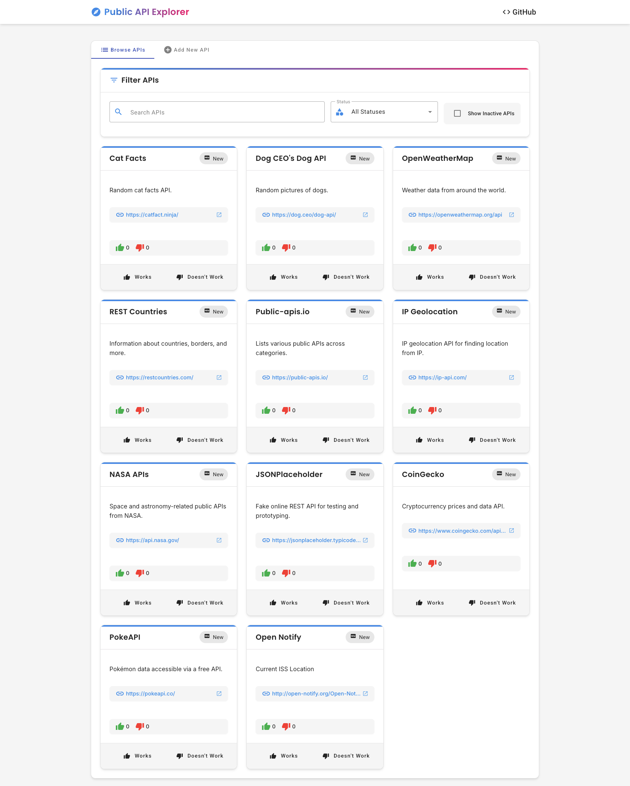
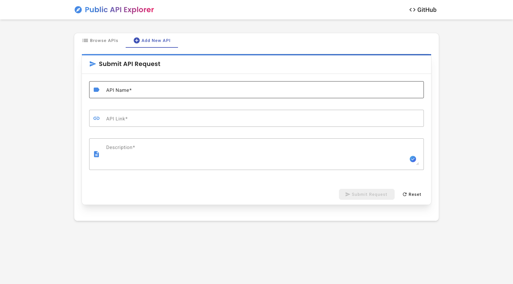
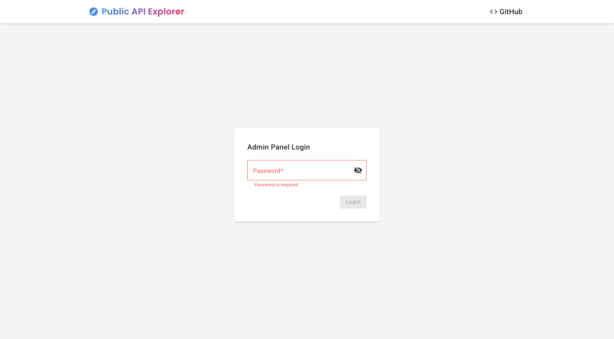
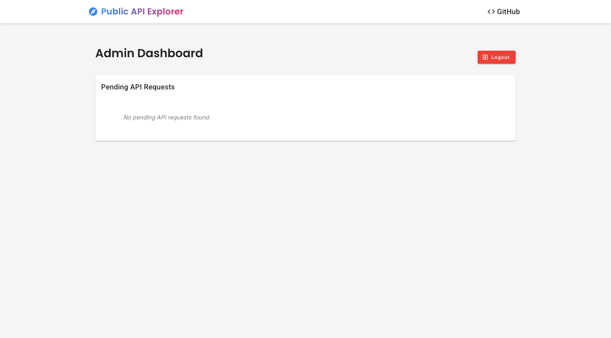

# Public API Explorer

A modern web application for discovering, sharing, and rating public APIs. This tool helps developers find reliable public APIs for their projects through community-driven ratings and reviews.

## Features

- **Browse Public APIs**: Explore a curated list of public APIs with detailed information
- **API Rating System**: Vote on APIs to indicate whether they work or not
- **API Status Tracking**: APIs are automatically categorized as New, Recommended, or Not Recommended based on community votes
- **API Submission**: Submit new APIs to the database
- **Admin Panel**: Manage API submissions and moderate content
- **Responsive Design**: Works on desktop and mobile devices

## Screenshots

### Home Page - API List


### Home Page - Filtered View


### Admin Login


### Admin Dashboard


## Technology Stack

- **Frontend**: Angular 20 with Angular Material
- **Backend**: Node.js with Express
- **Database**: SQLite (using better-sqlite3)
- **Other**: RxJS, TypeScript

## Installation

### Prerequisites

- Node.js (latest LTS version recommended)
- npm (comes with Node.js)

### Steps

1. Clone the repository:
   ```bash
   git clone https://github.com/naitharll/public-api-explorer
   cd public-api-explorer
   ```

2. Install dependencies:
   ```bash
   npm install
   ```

3. Start the application (both server and client):
   ```bash
   npm start
   ```

   This will start:
   - The backend server on port 3000
   - The Angular development server on port 4200 with proxy configuration

4. Alternatively, you can start the server and client separately:
   ```bash
   # Start only the backend server
   npm run start:server

   # In another terminal, start only the frontend
   npm run start:client
   ```

5. Open your browser and navigate to `http://localhost:4200`

## Usage

### Browsing APIs

- The home page displays a list of all active APIs
- Use the search bar to find APIs by name or description
- Filter APIs by status (New, Recommended, Not Recommended)
- Toggle the "Show Inactive" option to view APIs that have been marked as inactive

### Rating APIs

- Click the "Works" button to upvote an API
- Click the "Doesn't Work" button to downvote an API
- APIs with 5+ upvotes are marked as "Recommended"
- APIs with 3+ downvotes are marked as "Not Recommended"
- APIs with 5+ downvotes are automatically marked as inactive

### Submitting a New API

1. Click on the "Add New API" tab
2. Fill in the required information:
   - API Name
   - API Link (URL)
   - Description
3. Click "Submit" to add the API to the pending requests

### Admin Panel

1. Navigate to `/panel/login`
2. Enter admin credentials
3. From the dashboard, you can:
   - View pending API submissions
   - Approve or decline API submissions
   - Manage existing APIs

## API Status Logic

- **New**: APIs with 0-2 total votes
- **Recommended**: APIs with 5+ "works" votes
- **Not Recommended**: APIs with 3+ "doesn't work" votes
- **Active/Inactive**: APIs become inactive if they receive 5+ "doesn't work" votes

## Development

### Building the Application

```bash
npm run build
```

This will create a production build in the `dist/` directory.

### Running Tests

```bash
npm test
```

## License

[MIT License](LICENSE)

## Contributing

Contributions are welcome! Please feel free to submit a Pull Request.

1. Fork the repository
2. Create your feature branch (`git checkout -b feature/amazing-feature`)
3. Commit your changes (`git commit -m 'Add some amazing feature'`)
4. Push to the branch (`git push origin feature/amazing-feature`)
5. Open a Pull Request
